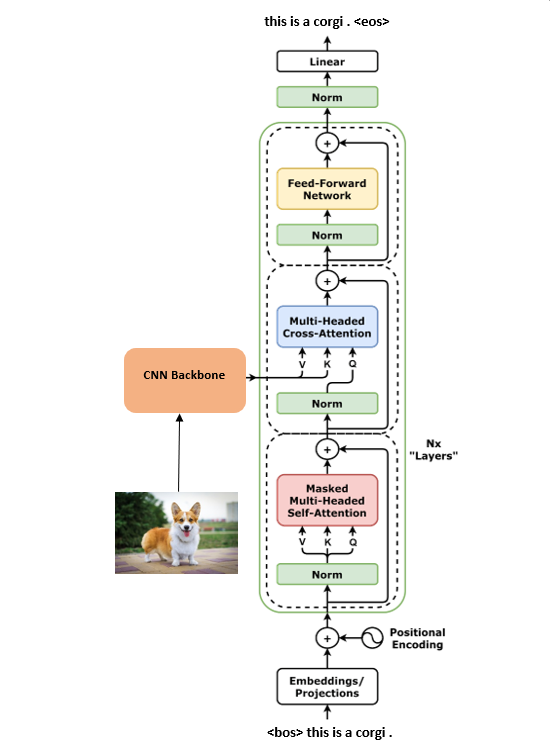

# Image Captioning with CNN-Transformer

<!-- ABOUT THE PROJECT -->
## About The Project

This project predicts captions for images by using a Transformer model with a pretrained EfficientNet as the encoder.

 

  

 

You can run the [demo](https://image-captioning-transformer.herokuapp.com/) on Heroku.

 

<!-- LICENSE -->
## License

Distributed under the MIT License. See `LICENSE` for more information.
  

<!-- CONTACT -->
## Contact

Stephen Lau - [Email](stephenlaulh@gmail.com) - [Twitter](https://twitter.com/StephenLLH) - [Kaggle](https://www.kaggle.com/faraksuli)

